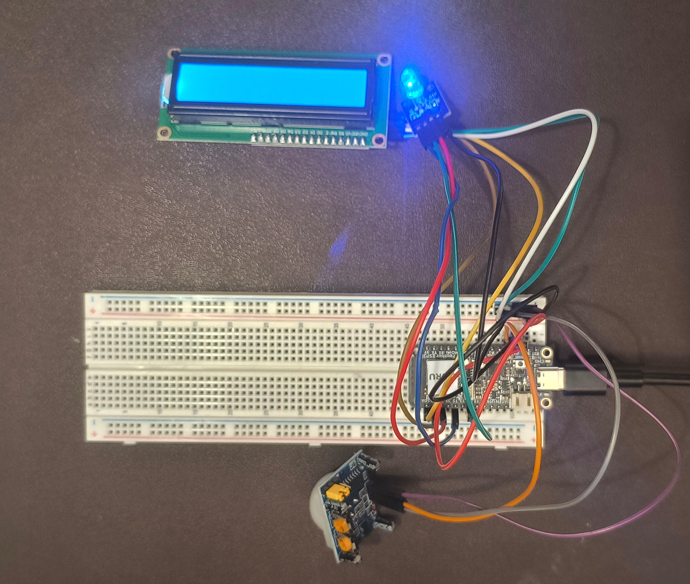

# Adewola Orogade
## Lab #5 Adventures with Actuators
### This is my last assignment working with the ESP32 and the purpose of this lab is to work on integrating sensors and actuators connected to the ESP32. I would modify the code on Visual Studio Code running on a Windows 11 device and will upload the code to the ESP32 using PlatformIO's build and upload features. In this repository, the code source files that integrates the Passive IR Motion sensor, LCD 1602 and the RGB LED actuataors (the file is main.cpp) can be found in the src folder. 

To successfully complete this lab,
1. I made and started to make edits on this current markdown file.
2. I opened the Lab 5 PlatformIO project and opened the main C++ source file.
3. I built a circuit integrating a Passive IR Motion sensor, LCD 1602, and RGB LED actuator as can be seen in the picture below:

4. I referenced Sunfouder's C++ program lessons and edited the main C++ program and configuration file to enable an RGB LED module and LCD 1602 to show distinct light and display outputs as a Passive IR Motion Sensor Module senses motions.
5. I compiled and uploaded the main program to the connected ESP32 before as I troubleshooted the circuit build and program files with the outputs of the LCD 1602, RGB LED Module, serial output monitor, and a debugging AI generated I2C Scanner C++ program.
12. I finalized this lab's C++ files before recording a video of a demonstration of the sensor-actuator integration builds
13. I completed the writing for the Time Reporting and Reflection for this lab before uploading the integration_exploration, photos files, and src files to my local and remote repository and my project videos to canvas.

**Time Reporting and Reflection**

1. How long did it take you to complete this assignment?  
This assignment took me around 4 hours to fully complete.
2. What level of difficulty would you associate with this assignment?  
I would associate this assignment with a difficulty level of Medium.
3. If you associated medium/high difficulty with this assignment, what aspect did you find the most difficult?  
I would say the medium difficulty parts was in the debugging of circuit as I made a couple of errors while building the circuit.
4. How comfortable do you currently feel with the course content?  
I think I feel alright with the course content but I would still like to have more learning experience understanding all the provided items in the Sunfounder kit.
5. Do you have any additional information or feedback you would like to share with the instructors?  
I found this to be an intriguing, challenging, and fun assignment!
