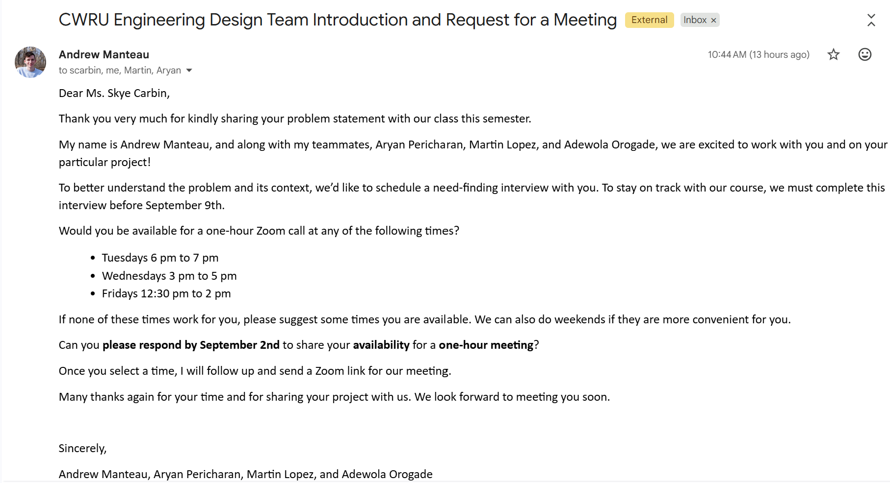

### Adewola Orogade
## Week 08/23

* 08/26 - I met with and introduced myself to the Team 4 for the first time during our class.
After getting to learn and know about one another, we discussed about our individuals in each of the project topics and decided to rank the topics based after attempting to come to a consensus.
* 08/27 - I met with my team members to work on and draft the stakeholder's introductory email.
My team members and I talked about various availabilities and decided on three distinct times to share with the stakeholder as possible times for a need-finding interview with our stakeholder.
Andrew, one of my team members, drafted and ended up sending the introductory email to our stakeholder on 08/28 as can be seen in the screenshot below:

* 08/28 - I met with my team members to work on a Team Contract where we reviewed the initial template provided roles and we chose roles we felt we were capable of assuming to support the team.
I decided to take on a new team member role, as a reviewer, to effectively support each other team member in their role and ensure a positive morale in the team.
We spoke about and added a few expectations we felt were necessary for ourselves as a team before agreeing and signing to the all contents of the contract. 
Furthermore, we decided to have any needed discussion about our team (including our weekly meeting times) as we understand our individual semester commitments.