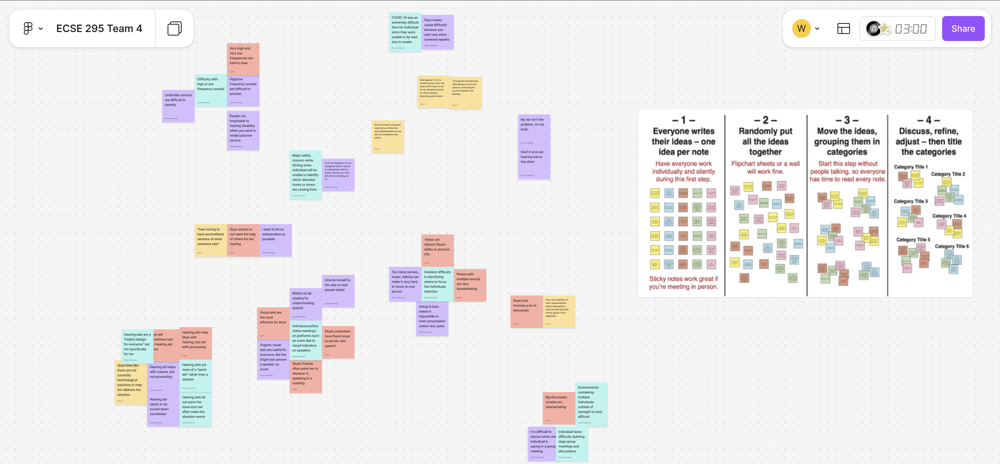

### Adewola Orogade
## Week 08/30

* 09/01 - After my team received and confirming a meeting time with our stakeholder, I started drafting a Stakeholder Needfinding Interview document for my Team to begin preparing for our upcoming meeting with our Stakeholder. 
* 09/02 - I briefly met with my Team to have a brief overview of the logistics for our meeting with our stakeholder a couple of minutes before our interview.
My team members and I met with our stakeholder at the scheduled time followed through on our decisions and utilized our updated Interview document to interview our stakeholder: Andrew, one of my team members, and I were the main individuals asking and discussing with the stakeholder about her situation and her needs as Martin and Aryan, my other two team members, actively took meeting minutes of our interview.
After our interview, my team members and I discussed how we felt the meeting went and what we thought we took out of our conversation with our stakeholder. We briefly reviewed the rubric for our Project Background and Needs Statement assignment and each made a Figma account to make our Figma board page. Lastly, my team members and I decided on the next date that we will meet to continue our work on our Needs Statement assignment.

These are Martin's notes from our interview:  
*[3:20] Interview start, introductions
[3:21] Day through life: workday
research coordinator, basic sciences & rehab
administrative, coordinator
“People person for people who are not people persons”
[3:22] Skye is deaf in one ear, partially deaf in other
Hampers comm. director role
Everyday situations
safety concern (driving)
[3:23] Particular sounds?
“sensorineural hearing loss”
Brain can’t process noise
Many sources of noise
Have to focus on one sound at a time
very low or very high frequencies
[3:25] Situations that are easier to parse sounds?
Easy when there’s only one source of sound
has to turn her head to hear sounds better
[3:27] methods of mitigation?	
virtual meetings very useful
visual methods are the most effective
audio cues are hardest
[3:29] how do you respond to tactile feedback?
smart watch vibrations useful
[3:30] Scenario where this caused 
team meetings
circular formation 
useful teammates
a lot to ask of others
“hate having to have secondhand versions of what someone said”
not appropriate to ask for clarification
“ I want to be as independent as possible”
[3:32] What do other people do to make it easier for you?
Chairs disability organizations
teammates do things to help
turn towards Skye for lip reading
tap & point to who’s talking
[3:33] Situations outside workplace?
watching movie, have to pause to hear friends talking
bars are very loud
walking around in the city
COVID-19, masking made hearing more difficult
[3:36] hearing aid, what kind?
bluetooth hearing aid, four years old, due for replacement
[3:37] difficulty processing?
hearing aid helps with volume, but not processing
has times where she turns hearing aid down
“My ear doesn’t have the problem, it’s my brain”
Great for degenerative hearing loss, only solution for Skye’s specific form of hearing loss
[3:40] technological visual aids?
organic visual aids tend to come up more
“A helpful design for everyone”
Nothing technology-wise for Skye’s specific hearing loss
localize where she should be focusing
Ideal case scenario: small lapel that lights up directions
[3:43] previous jobs in the past where people were not aware of disability
retail jobs
some people not hospitable 
ulta
many different senses, music, fragrances, people talking
[3:46] reach out if have more questions
[3:46] interview end
Skye personality:
“charismatic introvert”
resilient person*  

These are Aryan's notes from our interview:  
***Interviewee Background**
Background in mathematics
Works as a Coordinator at MetroHealth
Provides administrative and staffing support for research institutes and researchers
Supports the CTSC program and coordinates research-related activities
**Hearing and hearing aid**
Deaf in one ear and has partial hearing loss in the other ear.
Has sensorineural hearing loss, involving processing difficulties
Uses an Oticon hearing aid and has used it for approximately four years; plans to replace it soon
Relies significantly on lip reading
Tends to orient herself toward the side with partial hearing  
**Challenges**
The greatest difficulty is determining where a sound is coming from and where to focus her attention 
Environments containing multiple sounds are challenging
Having people speak louder does not help and can sometimes make it more difficult
Certain high and low frequency sounds can be difficult to process
Unfamiliar/ sounds can be especially difficult to identify 
Communication is much easier when only one person is speaking because there is only one sound source to focus on  
**Safety Concerns**
Difficulty determining sound direction can create safety issues while driving.
For example, she may hear a car horn but be unable to determine which direction the horn came from
Being able to rapidly identify where she needs to direct her attention is important in these situations.  
**Work & Social Impact**
Leading in-person meetings can be difficult, especially when multiple people speak simultaneously
It can be overwhelming to quiet a group 
Prefers to remain as independent as possible rather than relying on others for assistance
Group environments such as bars are challenging
Watching movies with friends can become difficult when people talk while the movie is playing because there are multiple competing sound sources
COVID-19 masks created significant communication difficulties because they prevented her from lip reading
Has experienced situations in retail and other workplaces where people can become frustrated or may not be accommodating of her hearing difficulties  
**Current Accommodations & Strategies**
Prefers online/video meetings when possible.
Video platforms make it easier to identify who is currently speaking through visual speaker indicators
Uses headphones, which help focus the sound
Relies heavily on visual indicators
Uses a smartwatch for notifications
Uses Bluetooth technology with her hearing aid  
**Limitations of Current Hearing Aid**
The hearing aid primarily amplifies sound rather than solving the processing problem
Described it as more of a “band-aid” than a solution
Hearing aid can sometimes make things worse when there are many sounds occurring simultaneously
She sometimes turns the hearing aid volume down because it is not always helpful
The hearing aid is not specifically designed around her particular hearing loss
More advanced technology may also present an insurance issue.*  

* 09/03 - I met with my team members to continue working on our Needs Statement Assignment.  

This are the meeting minutes for our meeting:  
*This meeting began on Friday, September 4, 2026, at 1:10PM. All team members were present.
We began by creating a new document, based on the blank template in Canvas, to write our submission for the Project Background and Needs Assessment assignment.
To start, we started placing various ideas from the interview in bullet points to answer the questions posed in the assignment. Once we have a sufficient quantity of info, we will combine the information into coherent paragraphs.
We also constructed a rough draft of our needs statement in the same document.
After this, we all took approximately 10 minutes to write down ideas on sticky notes on our shared Figma board in silence. Then we used a Figma plugin to randomly shuffle the notes.*  

My team members and I ended our meeting pausing at our Stakeholder Interview Affinity Clustering:

