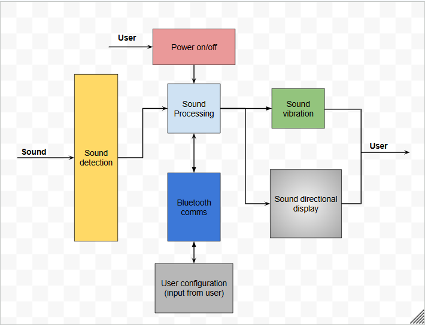
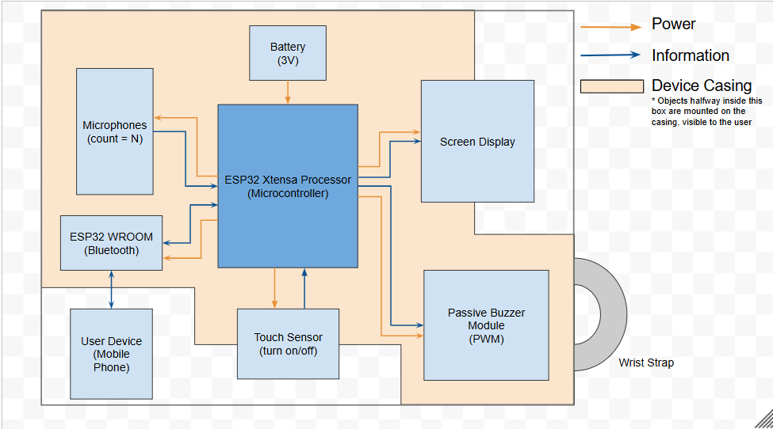

### Adewola Orogade
## Week 09/27

* 09/28 - I met virtually with my team members to continue working on our Concept Selection & Gantt Chart Assignment.  

This are the meeting minutes for our meeting:  
*We met on Monday, September 28, 2026, At 7:30 in a zoom meeting. Adewola, Aryan, and Martin were present in the call. Andrew was not present in the call, but still contributed during the meeting.
The goal of this meeting is to finish up our Gantt chart and submit our Concept Selection alongside it.
We began by discussing how to organize the Gantt chart. We’ve decided to split up the gantt chart based on subtasks for each assignment and milestone we have in canvas. We’re only mapping out the first two assignments, the concept selection and the system architecture, since we’re unsure how we organize the work for the more distant milestones.
We will update the Gantt chart every week with the next milestone’s subtasks.
Aryan worked on organizing our first milestone, the concept selection. Martin worked on setting up the next milestone, the system architecture and prototype plan. Adewola worked on setting up the verification and validation plan. Andrew fixed the formatting for the chart.
We have finished up the first three milestones for our Gantt chart. We plan on improving our Gantt chart on Wednesday.
Our meeting was adjourned at 8:54 pm.*  

I worked on outlining the tasks and dates of the week of the Verification and Validation Plan Milestones Assignment in my team's Gantt chart.

* 09/30 - I met with my team members to begin working on our System Architecture and Prototype Plan as we discussed and assigned our ourselves various tasks for this assignment.   

This are the meeting minutes for our meeting:  
*We met in Tomlinson Hall on Wednesday, September 30, 2026, at 3:00 PM. All members were present.
The goal of this meeting is to begin work on specifying the architecture of our first prototype and planning to begin construction.
We used our Gantt chart and discussed with one another to split up the work to be done. Assignments are as follows:
Andrew: System Overview
Adewola & Aryan: Interface Definitions
Martin: Unknowns, Assumptions, & Risks
All other parts will be done by all team members in collaboration.
We discussed the beginnings of a block diagram for our concept.
We adjourned at 3:30 PM.*  

* 10/02 - I  met with my team members to continue working on our System Architecture and Prototype Plan.  
 
These are my notes from our meeting with the stakeholder:  
*We met on Friday, October 2, 2026, at 1:00 PM in Glennan lounge. All members were present.
From 1:00 to 1:17, we worked together on our functional block diagram. The diagram has been completed.
We continued on to the physical architecture diagram. We completed this together at 2:00 PM. Discussed part selections such as how to implement bluetooth, turn-on switch, and screen type.
Martin, Andrew, and Aryan each developed part of the prototyping strategy while Adewola asked the professor for clarifying information on the goals of the assignment.
Andrew - Vibration
Aryan - Display
Martin - Audio
When Aryan returned, we discussed plans for creating our prototypes and work to be done individually before we meet again. This is now summarized in our Gantt chart.
We discussed meeting times for next week. Andrew sent a Google calendar invite for a meeting next Monday.
Adjourned at 3:00 PM.*  

My team and I decided to make and work on the Functional Block Diagram of our System on a Google Drawing as can be seen below:

My team and I decided to make and work on the Physical Architecture Diagram of our System on a Google Drawing as can be seen below:
